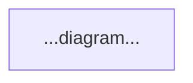

# Move Call Chain Diagrams

Generate a comprehensive call-chain reference document for Sui Move packages. The output is a single markdown file with Mermaid flowcharts showing every public/entry function's internal call chain, organized by user stories that follow the project's domain logic.

## Process Overview

1. **Extract** — Run the extraction script to inventory all functions
2. **Explore** — Read key modules to trace call chains
3. **Group** — Organize functions into domain-driven user stories
4. **Diagram** — Generate one Mermaid flowchart per independent operation
5. **Verify** — Build a completeness checklist to ensure full coverage

## Step 1: Extract Function Inventory

Run the extraction script on all Move packages in the project:

```bash
python3 ~/.claude/skills/move-call-chains/scripts/extract-move-functions.py \
  packages/pkg1 packages/pkg2 [...]
```

This produces a TSV with columns: `PACKAGE | MODULE | VISIBILITY | FUNCTION | PARAMS`

Review the output to understand scope:
- Count public vs. public(package) vs. private functions
- Identify which modules are large (many functions) vs. small (accessors only)
- Note any `entry` functions (direct transaction entry points)

## Step 2: Trace Call Chains

For each public function that performs meaningful work (not a pure accessor), read the source file and trace:

1. What validation helpers does it call?
2. What other module functions does it delegate to?
3. Does it branch (e.g., oversubscribed vs. undersubscribed)?
4. What external package calls does it make (PAS, Sui framework)?
5. What events does it emit?

**Priority order:** Start with the most complex modules (typically trading/matching engines and allocation logic), then work through simpler lifecycle functions.

**Pure accessors** (functions that just return a field) do not need call chain tracing. List them in a table in the appendix instead.

## Step 3: Organize as User Stories

Group functions into user stories based on the project's domain lifecycle. Each story should answer: "As a [role], I want to [action], so that [outcome]."

**Pattern for grouping:**
- Functions that share the same shared object (e.g., `Subscription`) often belong to the same story
- Functions gated by the same `Auth<Role>` form natural admin vs. user groups
- The project's lifecycle stages (creation → primary market → secondary market → redemption) define the story order

**Typical story categories for a DeFi/bond project:**
- Platform bootstrap (init functions)
- Role/permission management
- Token/stablecoin management
- Asset creation and configuration
- Primary market operations (subscription, bidding, allocation)
- Secondary market operations (order placement, matching, cancellation)
- Distribution/payout operations
- Redemption/settlement

## Step 4: Generate Mermaid Diagrams

Read `references/mermaid-style-guide.md` for the complete style conventions.

**Key rules:**
- One Mermaid block per independent operation (do NOT combine unrelated flows)
- Connected operations with cross-references MUST stay in a single diagram
- Use the color-coded node shapes to distinguish visibility levels
- Annotate edges with `Auth<Role>` requirements using `#60;` / `#62;` entities
- Keep diagrams under ~40 nodes; split into sub-diagrams if needed
- Merge Retail/Institutional variants that delegate to the same `_impl` function

**For each user story, write:**

```markdown
## Story N: [Title]

**As a** [role], **I want to** [action], **so that** [outcome].



**Additional notes or query function tables as needed.**
```

## Step 5: Build Completeness Checklist

After all diagrams are written, create three appendices:

**Appendix A: Pure Accessor Functions** — Table of all functions that return a field with no interesting call chain. Columns: Module, Function, Returns.

**Appendix B: Package-Internal Infrastructure** — Brief description of `public(package)` utility modules (constants, keys, version) that appear in diagrams but aren't directly user-callable. Include a table of key operations per module.

**Appendix C: Completeness Checklist** — Flat table listing EVERY public and public(package) function, with a column indicating which Story or Appendix covers it. Cross-reference against the Step 1 extraction output to ensure nothing was missed.

## Output File

Write the document to `CALL_CHAINS.md` at the project root (or the location the user specifies). Structure:

```
# Function-Level Call Chain Reference
## How to Read These Diagrams  (legend with node shape examples)
## Story 1: ...
## Story 2: ...
...
## Appendix A: Pure Accessor Functions
## Appendix B: Package-Internal Infrastructure
## Appendix C: Completeness Checklist
```

## Additional Resources

### Scripts
- **`scripts/extract-move-functions.py`** — Extracts all function declarations from Move source files with visibility, module, and parameter info

### Reference Files
- **`references/mermaid-style-guide.md`** — Complete Mermaid conventions: node shapes, colors, classDef block, generic type escaping, subgraph rules, edge label patterns
