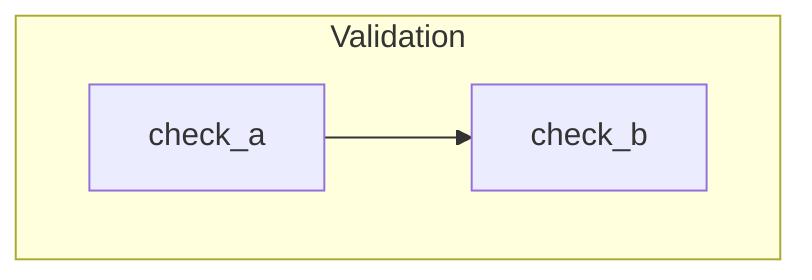

# Mermaid Style Guide for Move Call Chain Diagrams

## Diagram Type

Use `graph TD` (top-down flowcharts) for call chains. Sequence diagrams are for actor-level flows; flowcharts show function-to-function dependencies and branching.

## Node Shapes by Visibility

| Move Visibility | Mermaid Syntax | Shape | Color |
|-----------------|---------------|-------|-------|
| `public fun` (entry point) | `A(["function_name"]):::pub` | Stadium/rounded | Blue `#4A90D9` |
| `fun` (private helper) | `B["function_name"]:::priv` | Rectangle | Gray `#F5F5F5` |
| `public(package) fun` | `C(["function_name"]):::pkg` | Stadium | Green `#7BC47F` |
| External/PAS/framework call | `D[/"function_name"/]:::ext` | Parallelogram | Orange `#F4A460` |
| Branching condition | `E{"condition?"}:::cond` | Diamond | Yellow `#FFD700` |
| Event emission | `F[/"emit EventName"/]:::event` | Parallelogram | Purple `#DDA0DD` |

## Required classDef Block

Append this to every Mermaid diagram:

```
    classDef pub fill:#4A90D9,stroke:#2C5F8A,color:#fff,font-weight:bold
    classDef priv fill:#F5F5F5,stroke:#999,color:#333
    classDef pkg fill:#7BC47F,stroke:#4A8A4D,color:#fff
    classDef ext fill:#F4A460,stroke:#C07830,color:#fff
    classDef cond fill:#FFD700,stroke:#BBA000,color:#333
    classDef event fill:#DDA0DD,stroke:#9B6F9B,color:#333
```

## Generic Type Parameters

Move uses `<Type>` for generics. In Mermaid, angle brackets break the parser.

**Use Mermaid HTML entities:**
- `#60;` renders as `<`
- `#62;` renders as `>`

Example: `Auth#60;Admin#62;` renders as `Auth<Admin>`

**Apply inside quoted strings only:** `-->|"Auth#60;Admin#62;"|`

## Edge Labels for Auth Requirements

Annotate entry point edges with the required authorization:

```
A -->|"Auth#60;Admin#62;"| B
```

## Subgraph Usage

Use subgraphs to group related steps within a single flow:



**Critical rule: one diagram per independent operation.** Do NOT put multiple independent operations (e.g., "Mint BTN" and "Burn BTN") in the same Mermaid block — they render side by side and become unreadable. Each independent operation gets its own ```` ```mermaid ```` block.

Connected operations (where one subgraph references nodes in another, e.g., branching paths that converge) MUST stay in a single diagram.

## Line Breaks in Labels

Use `\n` inside labels for multi-line text:

```
A{"condition line 1\nline 2"}:::cond
```

## Node ID Conventions

Use short, descriptive prefixes per story section:

- `AL` for allocate, `PB` for place_bid, `CR` for create, `MT` for match_temporary, etc.
- Number sequentially within a section: `V1`, `V2`, `V3` for validation steps
- Prefix events with the operation: `PB5[/"emit BidPlaced"/]`

## Cross-Module Calls

Show the module boundary in the node label when a call crosses modules:

```
A(["book_matching::match_from_bid_taker(...)"]):::pkg
```

For PAS/external calls, use the parallelogram shape:

```
B[/"PAS: send_funds(account)"/]:::ext
```
